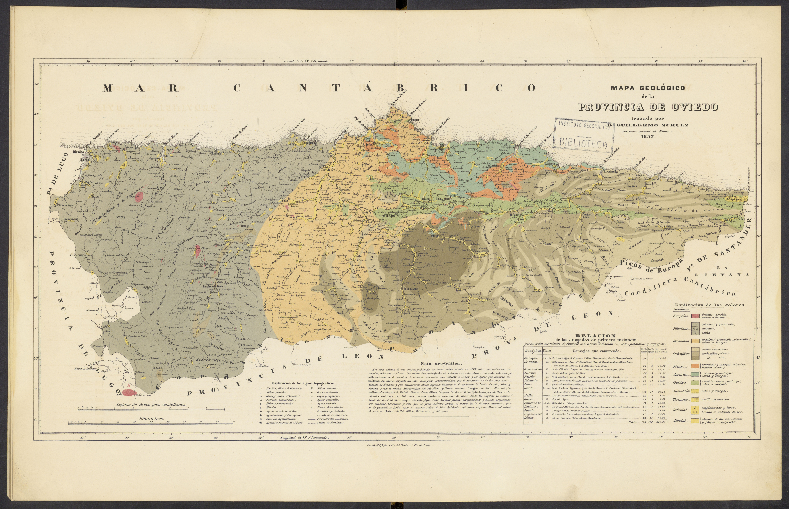

```{r message=FALSE, warning=FALSE}
knitr::opts_chunk$set(echo = TRUE, message = FALSE, warning = FALSE)
```


#  === 30 Day Map Challenge - 06_Dimensions ===

## Day callenge description

Challenge Classic: Map beyond 2D. Visualize data using 3D models, extrusions (building heights), depth, time (as a dimension), or an unconventional multivariate approach.

## Day 6 – Dimensions (3D Relief Map of Asturias, Spain)

This 3D relief map combines a modern digital elevation model (DEM) of Asturias with an antique geological map published by the Instituto Geográfico Nacional (IGN, Spain) in the mid-20th century.

The map is inspired by the work of cartographer Sean Conway, who transforms vintage maps into realistic 3D visualizations showing terrain elevation and texture.

The goal was to recreate a similar illustrative style — blending topographic depth with the aesthetic of traditional printed maps — to highlight the geological complexity of northern Spain’s landscapes.

Created with R (rayshader, terra, magick) as part of the collaborative challenge organized by the AEET Ecoinformatics group for the 2025 #30DayMapChallenge
.


```{r mapa_antiguo, echo=FALSE, out.width='100%', fig.cap="Original geological map (1857)"}

```


#  === Session info summary (for reproducibility)  ===

```{r message=FALSE, warning=FALSE}
# Core geospatial and visualization packages
library(sf)           # Spatial data handling
library(rnaturalearth) # Country/state boundaries
library(elevatr)      # DEM download from AWS
library(terra)        # Raster operations
library(magick)       # Image manipulation
library(rayshader)    # 3D rendering
library(rayrender)    # High-quality ray tracing
library(png)          # For raster import if needed
library(here)         # Path handling

packages <- c("sf", "rnaturalearth", "elevatr", "terra",
              "magick", "rayshader", "rayrender", "png", "here")
versions <- sapply(packages, function(p) as.character(packageVersion(p)))
data.frame(Package = packages, Version = versions)

```

# === Download boundaries and DEM ===

```{r}
spain <- ne_states(country = "Spain", returnclass = "sf")
asturias <- spain[spain$name == "Asturias", ]
```

```{r message=FALSE, warning=FALSE}
# Download digital elevation model (DEM)
dem <- get_elev_raster(asturias, z = 9, src = "aws")
dem_t <- rast(dem)
dem_crop <- crop(dem_t, asturias)
dem_mask <- mask(dem_crop, asturias)
plot(dem_mask, main = "DEM cut to Asturias")

# Convert to matrix for rayshader
dem_mat <- raster_to_matrix(dem_mask)
mask_mat <- !is.na(as.matrix(dem_mask))
```

# === Load old georeferenced map ===

```{r}
# This is the old map, georeferenced and cropped in QGIS, exported as GeoTIFF. 
overlay_rast <- rast("01_IGN/map_asturias_qgis.tif")

# Ensure same CRS and resolution
overlay_rast <- project(overlay_rast, dem_mask)
overlay_crop <- crop(overlay_rast, asturias)
overlay_crop <- mask(overlay_crop, asturias)

# Convert to RGB array (0–1)
ov <- as.array(overlay_crop) / 255

```


# === Create texture and shading ===


```{r}
# Smooth relief
dem_mat_smooth <- rayshader::resize_matrix(dem_mat, scale = 0.8)
```

```{r}
# === Visual orientation check ===
par(mfrow = c(1, 2), mar = c(1, 1, 1, 1))
## DEM
dem_preview <- sphere_shade(dem_mat, texture = "imhof3")
plot_map(dem_preview)
```


```{r}
## Overlay (old map)
overlay_preview <- ov
if (length(dim(overlay_preview)) == 3) {
  plot_map(overlay_preview)
}
```

```{r}
# Shading and warm ‘atlas’ lighting
ray <- ray_shade(dem_mat_smooth, sunangle = 260, zscale = 18, multicore = TRUE)
amb <- ambient_shade(dem_mat_smooth, zscale = 18)
tex <- sphere_shade(dem_mat_smooth, texture = "imhof3")  # tonos cálidos suaves

# Combine textures
base_img <- tex %>%
  add_shadow(ray, 0.5) %>%
  add_shadow(amb, 0.5)

# Add old map overlay (slightly transparent)
base_img_overlay <- add_overlay(base_img, ov, alphalayer = 0.95)

```


# === Render the 3D model ===

```{r}
# Beige atlas-style background
rgl::bg3d(color = "#e7dfcc")

base_img_overlay %>%
  plot_3d(
    dem_mat_smooth,
    zscale = 18,
    fov = 60,
    theta = 135,
    phi = 35,
    zoom = 0.75,
    windowsize = c(1200, 900),
    solid = TRUE,
    solidcolor = "#f9f4e8",
    shadowcolor = "grey80",
    background = "#e7dfcc"
  )
```

# === Export 3D image ===

```{r render_mapa, eval=FALSE}
# (will not run when knitting)
render_camera(theta = 120, phi = 35, zoom = 0.7, fov = 60)

render_highquality(
  filename = "mapa_asturias_3D_final_v0.png",
  samples = 256,
  lightdirection = 270,
  lightaltitude = 40,
  lightcolor = c("white", "orange"),
  ground_material = diffuse(color = "#f2efe4"),
  width = 4000, height = 2500,
  backgroundhigh = "#f3ebd6",
  backgroundlow  = "#f3ebd6",
  title_text = "3D geological map of Asturias",
  title_size = 22,
  title_color = "#2d2a26"
)
```


```{r fig.cap="3D geological map of Asturias", echo=FALSE, out.width='100%'}
knitr::include_graphics("map_asturias_3d_edit.PNG")
```

---

*Created by **Mónica Gómez-Vadillo**  
[GitHub: @mgomez26](https://github.com/mgomezv26)  
for the AEET Ecoinformatics group’s collaborative entry in the [#30DayMapChallenge 2025](https://30daymapchallenge.com/).*

