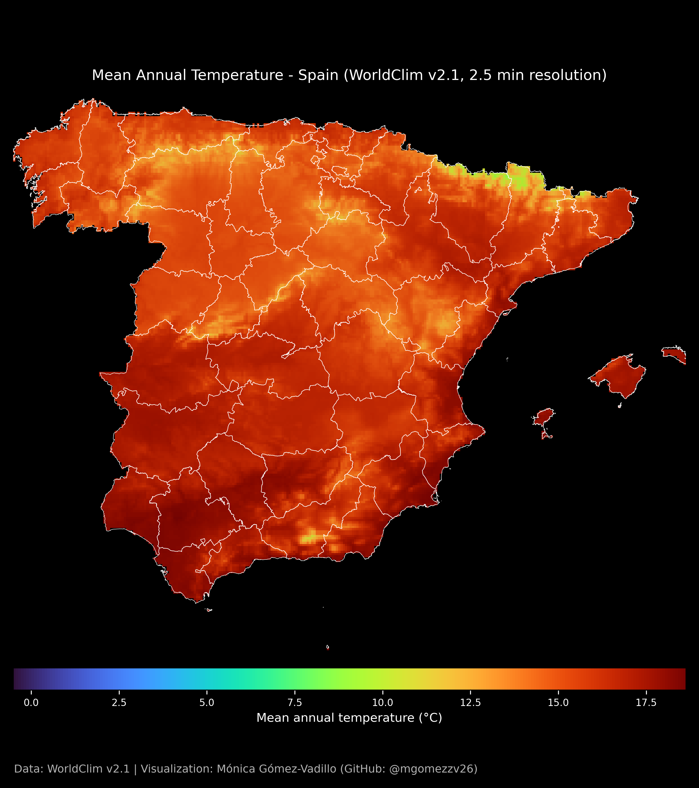
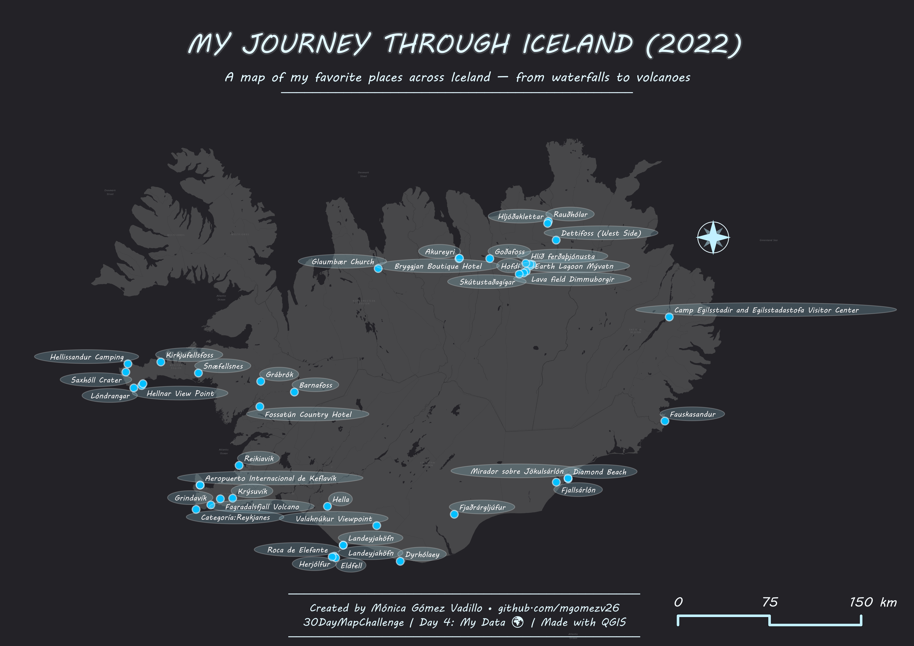
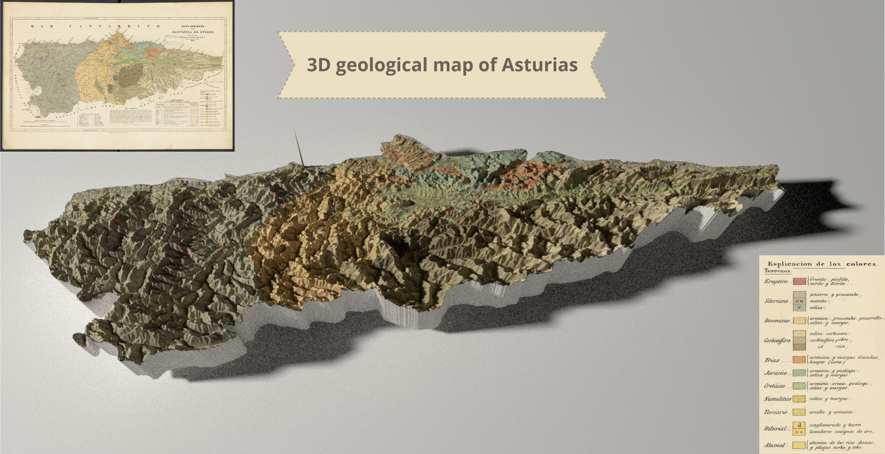

# 🌍 30 Day Map Challenge 2025

**Author:** [Mónica Gómez-Vadillo](https://github.com/mgomezv26)  
**Project:** #30DayMapChallenge 2025  
**Software:** R, QGIS

This repository documents my participation in the [#30DayMapChallenge 2025](https://30daymapchallenge.com/),
a global cartography challenge that consists of creating **one map per day during November**, each day based on a different theme.

## 03 \| Polygons
**Mean Annual Temperature - Spain (WorldClim v2.1, 2.5 min resolution)** \
This map shows the mean annual temperature (BIO1 variable) across Spanish provinces, using bioclimatic data from [WorldClim v2.1](https://www.worldclim.org/).  
The map combines administrative boundaries from the Instituto Geográfico Nacional (IGN) with high-resolution climate raster data to illustrate spatial temperature gradients across the Iberian Peninsula.  

## 04 | My Data

**My Journey Through Iceland (2022)**
This map visualizes my favorite places across Iceland, using location data exported from my personal Google Maps favorites (KML format).
All points were mapped and styled in QGIS, combining a dark basemap with minimal cyan markers to create a “night atlas” aesthetic.
The map represents 45 memorable locations — from volcanoes and waterfalls to coastal viewpoints and geysers — from my 2022 road trip around the island.

## 06 \| Dimensions
**3D Relief Map of Asturias, Spain** \
This 3D relief map combines a modern digital elevation model (DEM) of Asturias with an antique geological map published by the Instituto Geográfico Nacional (IGN, Spain) in the mid-20th century.

